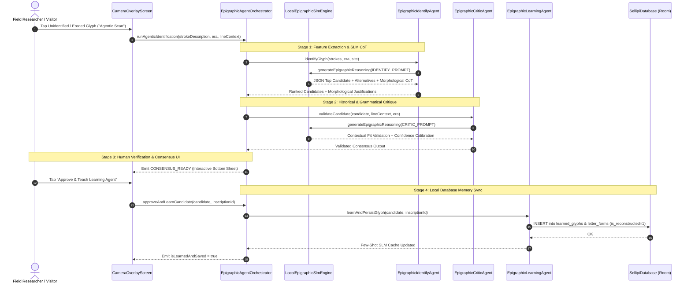
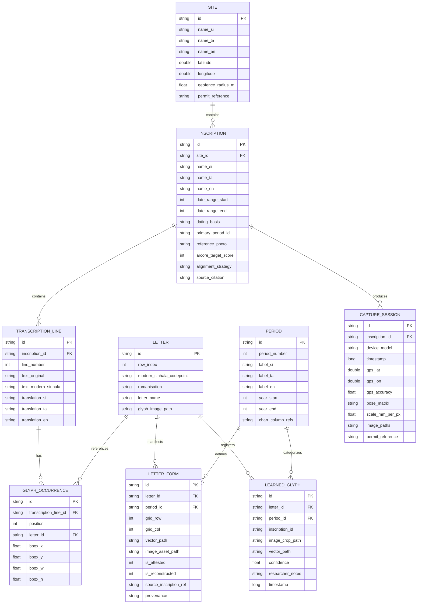

# Sellipi (සෙල්ලිපි) — AR Site Companion

[-3DDC84.svg?style=flat&logo=android)](https://www.android.com/)
[](https://kotlinlang.org/)
[](https://developer.android.com/jetpack/compose)
[](https://github.com/madusankapremaratne/stone-inscriptions-companion-kotlin)
[](https://developers.google.com/ar)
[-003B57.svg?style=flat&logo=sqlite)](https://developer.android.com/training/data-storage/room)
[](#licensing--ethics)

> **Offline-first Android application, on-device Small Language Model (SLM) multi-agent workflow, and field research instrument bridging ancient Sri Lankan epigraphy, Augmented Reality, and diachronic palaeographic letterform evolution.**

---

## 🏛️ Overview

**Sellipi** is an offline Android companion designed for visitors and researchers standing before ancient Sri Lankan stone inscriptions (dating from the 3rd century BCE Early Brahmi to the 10th century CE Classical Sinhala, such as those in Anuradhapura, Mihintale, and Polonnaruwa). 

The application blends deterministic epigraphical registration with an **On-Device Small Language Model (SLM) Multi-Agent Workflow** to assist when stone surfaces are weathered, eroded, or unindexed:

1. **Identification**: Pre-registered inscriptions are recognized via ARCore Augmented Images (the stone surface as its own target), fixed-offset markers, or geofenced selection.
2. **Alignment & Rendering**: Scholarly peer-reviewed transcriptions (*Epigraphia Zeylanica*, *Inscriptions of Ceylon*) and vector glyph assets are projected directly onto the physical stone surface via CameraX or ARCore.
3. **Palaeographic Evolution**: Visitors can tap any individual letter to observe its historical transformation across 18 historical periods, animated via dynamic 2D vector path morphing with honest representation of archaeological record gaps.
4. **Agentic SLM Workflow (Identify, Critic, & Learning Agents)**: When letters are eroded or ambiguous, a collaborative multi-agent pipeline reasons over stroke morphology, validates historical context, and persists newly confirmed glyph variations directly to the local Room database for continuous on-device learning.
5. **Researcher Field Capture Pipeline**: A credential-gated field capture tool records calibrated, multi-angle imagery with ARCore 6-DoF camera pose, depth-derived millimetre-per-pixel scale, and GPS metadata.

---

## 🤖 On-Device SLM & Multi-Agent Epigraphical Workflow

When stone carvings are partially degraded by centuries of weathering, optical pattern matching alone is insufficient. Sellipi introduces an **Edge SLM Multi-Agent System** that simulates a team of expert epigraphers collaborating in real time on device:



### Specialized Agents in the System:

| Agent | Responsibility | Core Reasoning Method |
|---|---|---|
| **🔍 Identify Agent** (`EpigraphicIdentifyAgent`) | Analyzes visual stroke topology (vertical spines, loops, crossbars, aspect ratios) and ranks candidate letters. | On-Device SLM Chain-of-Thought querying the 38-letter $\times$ 18-period Aksharamalawa matrix. |
| **⚖️ Critic Agent** (`EpigraphicCriticAgent`) | Evaluates candidate compatibility against historical era, regnal dating, and surrounding syntactic formula (e.g. `දෙවනපිය මහරඣහ...`). | Historical grammar & phonological plausibility scoring; adjusts confidence. |
| **💾 Learning Agent** (`EpigraphicLearningAgent`) | Commits verified identifications into the local Room database (`learned_glyphs` & `letter_forms`). | Persists vector paths, confidence, and primes the local on-device few-shot SLM cache for future sessions. |
| **🎼 Orchestrator** (`EpigraphicAgentOrchestrator`) | Coordinates the pipeline state machine and streams live thought steps to Jetpack Compose UI. | StateFlow reactive dispatching across UI bottom sheets and camera overlays. |

---

## ⚡ Core Philosophy & Architecture

```
┌────────────────────────────────────────────────────────────────────────┐
│                          Physical Inscription                          │
└───────────────────────────────────┬────────────────────────────────────┘
                                    │
                  ┌─────────────────┴─────────────────┐
                  ▼                                   ▼
        [ARCore Tracked Surface]            [Manual 4-Point Homography]
        (Augmented Images / Plaque)         (CameraX Universal Fallback)
                  │                                   │
                  └─────────────────┬─────────────────┘
                                    ▼
┌────────────────────────────────────────────────────────────────────────┐
│                           Sellipi App Core                             │
│                                                                        │
│   ┌─────────────────────┐   ┌──────────────────────────────────────┐   │
│   │ Offline Room DB     │   │ Vector Glyph Engine                  │   │
│   │ • Sites & Inscriptions│ │ • 38 Letters × 18 Attested Periods   │   │
│   │ • Transcriptions    │   │ • Dynamic SVG Path Interpolation     │   │
│   │ • Learned Glyphs    │   │ • Honest Gap Representation          │   │
│   └─────────────────────┘   └──────────────────────────────────────┘   │
│                                   │                                    │
│   ┌────────────────────────────────────────────────────────────┐       │
│   │ On-Device SLM Multi-Agent System                           │       │
│   │ • Identify Agent (Stroke Topology & Morphological CoT)     │       │
│   │ • Critic Agent (Syntactic & Historical Era Validator)      │       │
│   │ • Learning Agent (Local Database & Few-Shot Memory Sync)   │       │
│   └────────────────────────────────────────────────────────────┘       │
└───────────────────────────────────┬────────────────────────────────────┘
                                    │
                  ┌─────────────────┴─────────────────┐
                  ▼                                   ▼
      [Visitor Exploration Mode]           [Researcher Capture Mode]
      • Interactive Inscription HUD        • Multi-angle Coverage Guidance
      • Diachronic Letter Evolution        • 6-DoF Pose & mm/px Scale Matrix
      • Agentic Scan & Verification        • Local Cryptographic Export
```

### 1. Dual Viewing Pipeline

| Capability | **Overlay Mode (Universal Floor)** | **AR Mode (Enhanced Experience)** |
|---|---|---|
| **Underlying Tech** | Android CameraX + Custom Canvas | ARCore Augmented Images + SceneView / Filament |
| **Device Support** | 100% of Android devices (API 26+) | ARCore-compatible devices |
| **Alignment Method** | Freeze-frame + 4-point draggable quad warp | Real-time 6-DoF feature tracking & surface anchoring |
| **Target Audience** | Low/mid-tier phones, high-glare conditions | Modern ARCore hardware in shaded/structured conditions |

### 2. Absolute Offline-First Design
Archaeological reserves (Mihintale, Ritigala, Polonnaruwa) often lack cellular data. Sellipi functions completely with airplane mode enabled:
- Pre-seeded Room SQLite database bundled in APK / downloadable site pack.
- Zero network dependencies during visitor runtime.
- On-device SLM inference and vector morphing executed entirely local to the CPU/NPU.

---

## 📐 Data Model Schema

The local relational schema enforces historical accuracy, epigraphical provenance, and continuous learning:



---

## 🛠️ Technology Stack

- **Core & Architecture**: Kotlin 2.0+, Clean Architecture + MVI / MVVM, Android Jetpack.
- **UI Framework**: Jetpack Compose, Material Design 3 (High-Contrast Theme for outdoor sunlight readability).
- **On-Device SLM & Agents**:
  - **Edge SLM Interface** (Quantized local inference with structured JSON output).
  - **Multi-Agent Orchestration** (`IdentifyAgent`, `CriticAgent`, `LearningAgent`).
- **Camera & Vision**:
  - **CameraX** (Preview, ImageCapture, Matrix Analysis for Overlay Mode).
  - **ARCore SDK** (Augmented Images, Trackable Pose, Depth API).
- **3D & Vector Graphics**:
  - **SceneView / Filament** (Lightweight Android AR anchoring).
  - **Compose Graphics / Android GraphicVector** (Bézier path morphing & interpolation).
- **Local Persistence**: Room Database, SQLite, EncryptedSharedPreferences.
- **Location**: Google Play Services Location (FusedLocationProviderClient, Geofencing).
- **Asynchronous Flow**: Kotlin Coroutines, StateFlow, SharedFlow.

---

## 🗂️ Project Structure

```
stone-inscriptions-companion-kotlin/
├── app/
│   ├── src/
│   │   ├── main/
│   │   │   ├── assets/                 # Pre-seeded SQLite DB & Site Packs
│   │   │   │   ├── databases/sellipi.db
│   │   │   │   └── glyph_images/       # 395 extracted transparent PNG glyphs
│   │   │   ├── java/org/sellipi/companion/
│   │   │   │   ├── agent/              # Multi-Agent Workflow Engine
│   │   │   │   │   ├── model/          # AgentThoughtStep, GlyphCandidate, AgentStage
│   │   │   │   │   ├── EpigraphicIdentifyAgent.kt
│   │   │   │   │   ├── EpigraphicCriticAgent.kt
│   │   │   │   │   ├── EpigraphicLearningAgent.kt
│   │   │   │   │   └── EpigraphicAgentOrchestrator.kt
│   │   │   │   ├── core/               # Design system, theme, base classes
│   │   │   │   │   ├── common/
│   │   │   │   │   └── theme/          # High-contrast outdoor palettes
│   │   │   │   ├── data/               # Room entities, DAOs, repositories
│   │   │   │   │   ├── local/
│   │   │   │   │   └── repository/
│   │   │   │   ├── domain/             # Use cases & business logic
│   │   │   │   │   ├── model/
│   │   │   │   │   └── usecase/
│   │   │   │   ├── engine/             # Specialized engines
│   │   │   │   │   ├── ar/             # ARCore Augmented Images session manager
│   │   │   │   │   ├── homography/     # 4-point perspective warp calculations
│   │   │   │   │   ├── morph/          # SVG vector path morphing & interpolation
│   │   │   │   │   ├── sensor/         # FusedLocation & Depth scale calculator
│   │   │   │   │   └── slm/            # On-Device Small Language Model & Prompts
│   │   │   │   ├── ui/                 # Jetpack Compose Screens & ViewModels
│   │   │   │   │   ├── agent/          # Agentic Workflow Bottom Sheet & CoT HUD
│   │   │   │   │   ├── home/           # Site & Inscription selector / Geofence
│   │   │   │   │   ├── overlay/        # CameraX 4-point alignment viewer
│   │   │   │   │   ├── ar/             # ARCore 3D spatial overlay screen
│   │   │   │   │   ├── evolution/      # Diachronic letter evolution viewer
│   │   │   │   │   └── researcher/     # Calibrated field capture & export
│   │   │   │   ├── MainActivity.kt
│   │   │   │   └── SellipiApplication.kt
│   │   │   └── res/
│   │   └── test/                       # Unit Tests (SLM, Agents, Homography, Morphing)
│   └── build.gradle.kts
├── docs/                               # Epigraphical documentation & spreadsheets
├── gradle/
├── scripts/
│   └── build_database.py               # Automated SQLite database builder
├── build.gradle.kts
├── settings.gradle.kts
└── README.md
```

---

## 🔬 Researcher Field Capture Mode

Site photography permits are scarce and strictly regulated. The application embeds a gated **Researcher Capture Mode**:
- **Multi-Angle Coverage Overlay**: Real-time visual feedback indicating which regions of the inscription face have been photographed across 8 azimuth/elevation sectors.
- **Calibrated Metadata**: Each capture records:
  - 6-DoF ARCore camera pose matrix.
  - Scale factor in **mm/pixel** derived from optical sensors.
  - GPS coordinates + accuracy radius.
  - Device sensor profiles, timestamp, and Department of Archaeology permit ID.
- **Strict Data Sovereignty**: All imagery and telemetry stay strictly on-device in local sandbox storage, exportable as an encrypted package.

---

## 🗺️ Implementation Roadmap

```
[Phase 0: Clearance & Foundation] ➔ [Phase 1: Data Model & Glyphs] ➔ [Phase 2: Overlay Mode (MVP)]
                                                                               │
[Phase 5: Field Hardening] 🠤 [Phase 4: Researcher Capture] 🠤 [Phase 3: AR & Agentic SLM Flow]
```

- **Phase 0 — Clearance & Foundation**: Pilot site selection (Mihintale, Anuradhapura), reference photo capture & `arcoreimg` quality scoring.
- **Phase 1 — Data Model & Vector Library**: Room SQLite database schema, pre-population scripts, 395 extracted glyph assets across 38 letters $\times$ 18 periods.
- **Phase 2 — Overlay Mode [First Shippable MVP]**: CameraX preview, 4-point perspective alignment, interactive letter bounding boxes, trilingual content browser, path morphing animation.
- **Phase 3 — AR & Agentic SLM Flow**: ARCore Augmented Images session, on-device SLM inference, multi-agent reasoning pipeline (`Identify` $\rightarrow$ `Critic` $\rightarrow$ `Learning`), and database learning sync.
- **Phase 4 — Researcher Capture Mode**: Guided multi-angle image capture, 6-DoF pose and scale metadata logging, local encrypted export bundle.
- **Phase 5 — Field Trial & Outdoor Hardening**: Direct sunlight high-contrast validation, thermal throttling mitigation, battery power profiling, visitor comprehension tests.

---

## 📜 Licensing & Ethics

- **Epigraphical Data**: Transcriptions derived from public-domain scholarly publications (*Epigraphia Zeylanica*, *Inscriptions of Ceylon*), cited per inscription.
- **Vector Glyph Forms**: Re-traced vector originals from public-domain stone inscriptions and estampages. Reconstructed or non-attested glyphs are explicitly tagged and never presented as historical artifacts.
- **Site Regulations**: All field photography conducted in accordance with regulations set forth by the Department of Archaeology, Sri Lanka.

---

## 📚 References & Citations

1. Department of Archaeology, Sri Lanka — *Epigraphia Zeylanica (Vols. I–VI)*.
2. Paranavitana, S. — *Inscriptions of Ceylon (Early Brahmi Inscriptions)*.
3. Google ARCore Documentation — *Augmented Images Developer Guide*.
