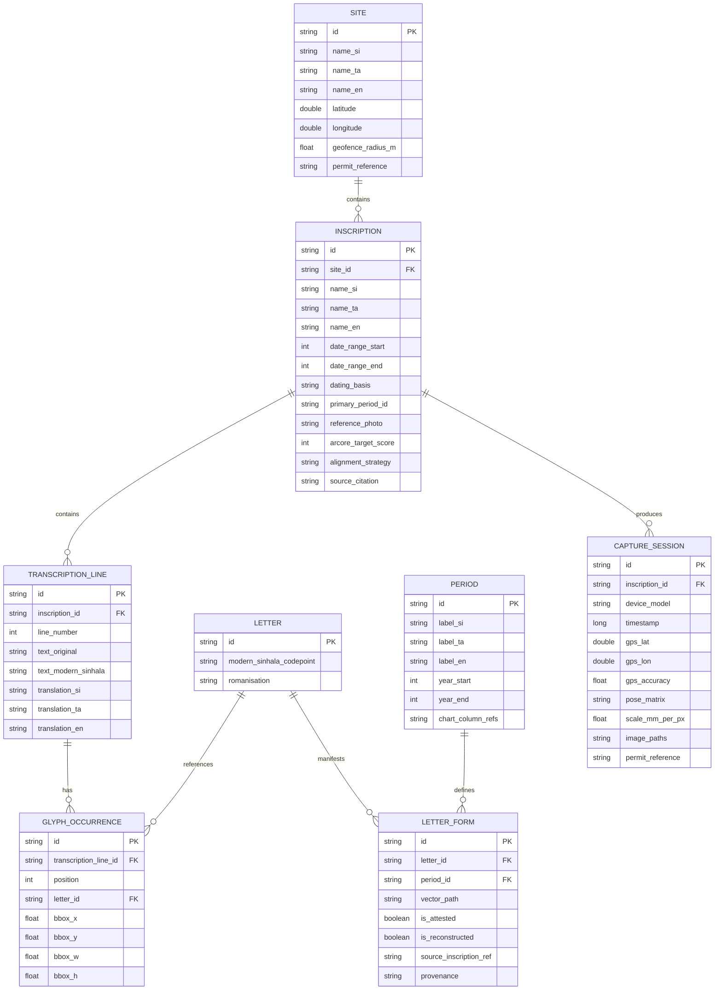

# Sellipi (සෙල්ලිපි) — AR Site Companion

[-3DDC84.svg?style=flat&logo=android)](https://www.android.com/)
[](https://kotlinlang.org/)
[](https://developer.android.com/jetpack/compose)
[](https://developers.google.com/ar)
[-003B57.svg?style=flat&logo=sqlite)](https://developer.android.com/training/data-storage/room)
[](#licensing--ethics)

> **Offline-first Android application and field research instrument bridging ancient Sri Lankan epigraphy, Augmented Reality, and diachronic palaeographic letterform evolution.**

---

## 🏛️ Overview

**Sellipi** is an offline Android companion designed for visitors and researchers standing before ancient Sri Lankan stone inscriptions (dating from the 3rd century BCE to the 7th century CE, such as those in Anuradhapura, Mihintale, and Polonnaruwa). 

Rather than attempting unreliable on-device glyph recognition on weathered, eroded rock surfaces, Sellipi decouples **identification** from **reading**:

1. **Identification**: The app identifies the inscription via ARCore Augmented Images (the stone surface as its own target), fixed-offset physical markers/QR codes, or geofenced manual selection.
2. **Alignment & Rendering**: Once identified, scholarly peer-reviewed transcriptions (*Epigraphia Zeylanica*, *Inscriptions of Ceylon*) and vector glyph assets are projected directly onto the physical inscription.
3. **Palaeographic Evolution**: Visitors can tap any individual letter to observe its historical transformation across eleven attested archaeological periods, animated via 2D vector path morphing. Unattested historical gaps are rendered honestly as gaps.
4. **Researcher Capture Pipeline**: A credential-gated field capture tool records calibrated, multi-angle imagery with ARCore 6-DoF camera pose, depth-derived millimetre-per-pixel scale, and GPS metadata to build the ground-truth corpus needed for future machine learning research.

---

## ⚡ Core Philosophy & Architecture

```
┌────────────────────────────────────────────────────────────────────────┐
│                          Physical Inscription                          │
└───────────────────────────────────┬────────────────────────────────────┘
                                    │
                  ┌─────────────────┴─────────────────┐
                  ▼                                   ▼
        [ARCore Tracked Surface]            [Manual 4-Point Homography]
        (Augmented Images / Plaque)         (CameraX Universal Fallback)
                  │                                   │
                  └─────────────────┬─────────────────┘
                                    ▼
┌────────────────────────────────────────────────────────────────────────┐
│                           Sellipi App Core                             │
│                                                                        │
│   ┌─────────────────────┐   ┌──────────────────────────────────────┐   │
│   │ Offline Room DB     │   │ Vector Glyph Engine                  │   │
│   │ • Sites             │   │ • 38 Letters × 11 Attested Periods   │   │
│   │ • Inscriptions      │   │ • Dynamic SVG Path Interpolation     │   │
│   │ • Transcriptions    │   │ • Honest Gap Representation          │   │
│   │ • Bounding Boxes    │   │ • Sinhala / Tamil / English Context  │   │
│   └─────────────────────┘   └──────────────────────────────────────┘   │
└───────────────────────────────────┬────────────────────────────────────┘
                                    │
                  ┌─────────────────┴─────────────────┐
                  ▼                                   ▼
      [Visitor Exploration Mode]           [Researcher Capture Mode]
      • Interactive Inscription HUD        • Multi-angle Coverage Guidance
      • Diachronic Letter Evolution        • 6-DoF Pose & mm/px Scale Matrix
      • Trilingual Commentary              • Local Cryptographic Export
```

### 1. Decoupling Identification from Recognition
Recognising eroded Early/Late Brahmi glyphs under uncontrolled outdoor lighting is an unsolved computer vision problem lacking benchmark datasets. By pre-registering inscriptions and their validated transcriptions, Sellipi guarantees 100% reading accuracy in the field.

### 2. Dual Viewing Pipeline

| Capability | **Overlay Mode (Universal Floor)** | **AR Mode (Enhanced Experience)** |
|---|---|---|
| **Underlying Tech** | Android CameraX + Custom Canvas | ARCore Augmented Images + SceneView / Filament |
| **Device Support** | 100% of Android devices (API 26+) | ARCore-compatible devices |
| **Alignment Method** | Freeze-frame + 4-point draggable quad warp | Real-time 6-DoF feature tracking & surface anchoring |
| **Target Audience** | Low/mid-tier phones, high-glare conditions | Modern ARCore hardware in shaded/structured conditions |

### 3. Absolute Offline-First Design
Archaeological reserves (Mihintale, Ritigala, Polonnaruwa) often lack cellular data. Sellipi functions completely with airplane mode enabled:
- Pre-seeded Room SQLite database bundled in APK / downloadable site pack.
- Zero network dependencies during visitor runtime.
- Vector glyphs stored as path definitions (minimal memory & storage footprint).

---

## 📐 Data Model Schema

The local relational schema enforces historical accuracy and epigraphical provenance:



---

## 🛠️ Technology Stack

- **Core & Architecture**: Kotlin 2.0+, Clean Architecture + MVI / MVVM, Android Jetpack.
- **UI Framework**: Jetpack Compose, Material Design 3 (High-Contrast Theme for outdoor sunlight readability).
- **Camera & Vision**:
  - **CameraX** (Preview, ImageCapture, Matrix Analysis for Overlay Mode).
  - **ARCore SDK** (Augmented Images, Trackable Pose, Depth API).
- **3D & Vector Graphics**:
  - **SceneView / Filament** (Lightweight Android AR anchoring).
  - **Compose Graphics / Android GraphicVector** (Bézier path morphing & interpolation).
- **Local Persistence**: Room Database, SQLite, EncryptedSharedPreferences (researcher mode credentials).
- **Location**: Google Play Services Location (FusedLocationProviderClient, Geofencing).
- **Asynchronous Flow**: Kotlin Coroutines, StateFlow, SharedFlow.
- **Dependency Injection**: Hilt (Dagger) / Koin.

---

## 🗂️ Project Structure

```
stone-inscriptions-companion-kotlin/
├── app/
│   ├── src/
│   │   ├── main/
│   │   │   ├── assets/                 # Pre-seeded SQLite DB & Site Packs
│   │   │   │   ├── databases/sellipi.db
│   │   │   │   └── reference_targets/  # ARCore .imgdb reference imagery
│   │   │   ├── java/org/sellipi/companion/
│   │   │   │   ├── core/               # Design system, theme, base classes
│   │   │   │   │   ├── common/
│   │   │   │   │   └── theme/          # High-contrast outdoor palettes
│   │   │   │   ├── data/               # Room entities, DAOs, repositories
│   │   │   │   │   ├── local/
│   │   │   │   │   └── repository/
│   │   │   │   ├── domain/             # Use cases & business logic
│   │   │   │   │   ├── model/
│   │   │   │   │   └── usecase/
│   │   │   │   ├── engine/             # Specialized engines
│   │   │   │   │   ├── ar/             # ARCore Augmented Images session manager
│   │   │   │   │   ├── homography/     # 4-point perspective warp calculations
│   │   │   │   │   └── morph/          # SVG vector path morphing & interpolation
│   │   │   │   ├── ui/                 # Jetpack Compose Screens & ViewModels
│   │   │   │   │   ├── home/           # Site & Inscription selector / Geofence
│   │   │   │   │   ├── overlay/        # CameraX 4-point alignment viewer
│   │   │   │   │   ├── ar/             # ARCore 3D spatial overlay screen
│   │   │   │   │   ├── evolution/      # Diachronic letter evolution viewer
│   │   │   │   │   └── researcher/     # Calibrated field capture & export
│   │   │   │   └── SellipiApp.kt
│   │   │   └── res/
│   │   └── test/                       # Unit & Domain Tests
│   └── build.gradle.kts
├── docs/
│   └── architecture.md                 # Full architectural specification
├── gradle/
├── build.gradle.kts
├── settings.gradle.kts
└── README.md
```

---

## 🔬 Researcher Field Capture Mode

Site photography permits are scarce and strictly regulated. The application embeds a gated **Researcher Capture Mode**:
- **Multi-Angle Coverage Overlay**: Real-time visual feedback indicating which regions of the inscription face have been photographed across azimuth and elevation angles.
- **Calibrated Metadata**: Each capture records:
  - 6-DoF ARCore camera pose matrix.
  - Scale factor in **mm/pixel** derived from ARCore Depth / Time-of-Flight sensors.
  - GPS coordinates + accuracy radius.
  - Device sensor profiles, timestamp, and Department of Archaeology permit ID.
- **Strict Data Sovereignty**: All imagery and telemetry stay strictly on-device in local sandbox storage, exportable as an encrypted package. No unverified third-party cloud uploads.

---

## 🗺️ Implementation Roadmap

```
[Phase 0: Clearance & Foundation] ➔ [Phase 1: Data Model & Glyphs] ➔ [Phase 2: Overlay Mode (MVP)]
                                                                               │
[Phase 5: Field Hardening] 🠤 [Phase 4: Researcher Capture] 🠤 [Phase 3: ARCore Mode]
```

- **Phase 0 — Clearance & Foundation (Weeks 1–3)**: Rights clearance, pilot site selection (e.g., Mihintale / Anuradhapura), reference photo capture & `arcoreimg` quality scoring.
- **Phase 1 — Data Model & Vector Library (Weeks 4–7)**: Room SQLite database schema, pre-population scripts, re-traced SVG vector glyph library (38 letters × 11 periods).
- **Phase 2 — Overlay Mode [First Shippable MVP] (Weeks 8–11)**: CameraX preview, 4-point perspective alignment, interactive letter bounding boxes, trilingual content browser, path morphing animation.
- **Phase 3 — AR Mode (Weeks 12–15)**: ARCore Augmented Images session, SceneView anchoring, automatic fallback between AR and Overlay modes.
- **Phase 4 — Researcher Capture Mode (Weeks 16–18)**: Guided multi-angle image capture, 6-DoF pose and scale metadata logging, local export bundle.
- **Phase 5 — Field Trial & Outdoor Hardening (Weeks 19–21)**: Direct sunlight UI adjustments, thermal throttling mitigation, battery power profiling, visitor comprehension tests.

---

## 📜 Licensing & Ethics

- **Epigraphical Data**: Transcriptions derived from public-domain scholarly publications (*Epigraphia Zeylanica*, *Inscriptions of Ceylon*), cited per inscription.
- **Vector Glyph Forms**: Re-traced vector originals from public-domain stone inscriptions and estampages. Reconstructed or non-attested glyphs are explicitly tagged and never presented as historical artifacts.
- **Site Regulations**: All field photography conducted in accordance with regulations set forth by the Department of Archaeology, Sri Lanka.

---

## 📚 References & Citations

1. Department of Archaeology, Sri Lanka — *Epigraphia Zeylanica (Vols. I–VI)*.
2. Paranavitana, S. — *Inscriptions of Ceylon (Early Brahmi Inscriptions)*.
3. Google ARCore Documentation — *Augmented Images Developer Guide*.
